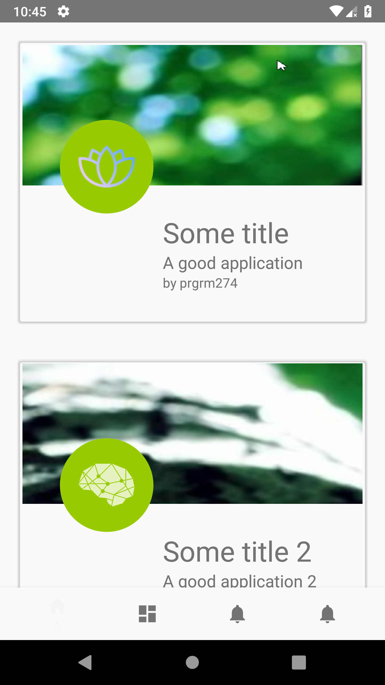

# Login Register

A sample app of Login Register app in Android with PHP and MySQL

1. If user login not saved then it shows `login` page

2. If user are not registered yet and press register then it shows `register` page

3. If user succesfully logged in then it will be directed to `main` page

